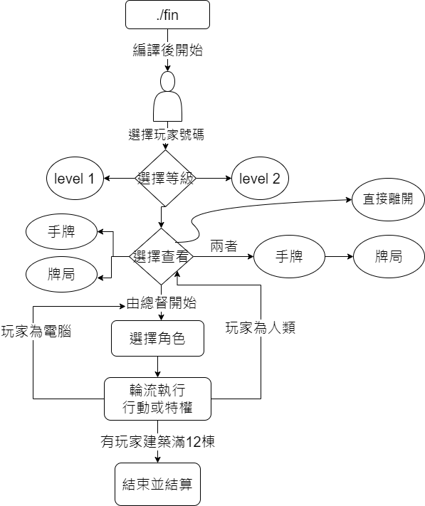

# document
40947019S 彭安慈
---
# 檔案分類
1. fin.c (主程式)
2. struct.h (設計結構)
3. function.h (函式設計)
4. profession.h (角色函式設計)
# 我的結構 (struct.h)
## 玩家
```C
typedef struct _player {
    card cards;//手牌
    int number_of_cards;//卡牌數量
    int buildings[12];//場上的建築
    int numbers_of_buildings;//建築的數量
    int point;//當前積分
    int product_limit;//生產貨物的上限
    int card_limit;//手牌上限
    c buildingInfo[12];//建築上是否有貨物
    int numbers_of_products;//貨物數量
    special_effective specials;//已建出的特殊建築的技能
    int card_under;//多少張牌在禮拜堂下
} _player;
```
### 卡牌部分：
用linking list儲存手牌資訊並記錄當前手牌數，以及數量上限。  
(刪除及增加卡牌比較方便)
### 建築部分
用array存取卡牌編號及其他資訊(如：是否有貨物)，並記錄擁有的建築數量，以及當前貨物的數量。  
(建築上限固定，用array較方便增加及記錄建築資訊，遇到起重機時也方便替換，紀錄貨物數量及卡牌資訊有利於在遇到生產者及商人時可直接使用)
### 特殊卡牌功能
用一個union儲存有哪些特殊建築，其功能可以開始使用。  
(建造建築時可直接藉由bit shift 及卡牌編號將該卡牌的功能開啟，也方便判斷使否已經建有此建築)
### 紀錄有多少牌在禮拜堂下
因遇到起重機時，在禮拜堂下的卡牌仍保留，且不會有其他行為需要紀錄卡牌是被放在哪張牌之下，因此直接記錄在玩家的struct中。
## 卡牌
```C
typedef struct {
    int id;//卡牌編號
    char en_name[20];//卡牌的英文名字
    char ch_name[20];//卡牌的中文名字
    int pay;//費用
    int point;//分數
    char effective[600];//特殊功能
} cardSet;
cardSet cardType[29]
```
### 原因
用一個結構陣列紀錄卡牌資訊，建造或是讓玩家選擇保留哪些牌時，只需記錄卡牌的編號，就能藉由此陣列取得其他卡牌資訊並使用或印出。

## 角色
```C
typedef struct _role {
    char name[20];//角色名字
    char privilege[100];//特權
    char action[200];//行動
} role;
```
### 使用
這個結構主要是在印角色訊息的時候用的

## 特殊建築的功能
```C
typedef union _specail {
    uint32_t byte;
    struct {
        uint8_t Tower: 1;
        uint8_t Chapel: 1;
        uint8_t Smithy: 1;
        uint8_t PoorHouse: 1;
        uint8_t BlackMarket: 1;
        uint8_t Crane: 1;
        uint8_t Carpenter: 1;
        uint8_t Quarry: 1;
        uint8_t Well: 1;
        uint8_t Aqueduct: 1;
        uint8_t MarketStand: 1;
        uint8_t MarketHall: 1;
        uint8_t TradingPost: 1;
        uint8_t Archive: 1;
        uint8_t Prefecture: 1;
        uint8_t GoldMine: 1;
        uint8_t Library: 1;
        uint8_t Status: 1;
        uint8_t VictoryColumn: 1;
        uint8_t Hero: 1;
        uint8_t GuildHall: 1;
        uint8_t CityHall: 1;
        uint8_t TriumhalArch: 1;
        uint8_t Palace: 1;
    }build;
} __attribute__((packed)) special_effective;
```
## gobal 變數
```C
int price[5][5] = {
    {1, 1, 1, 2, 2}, 
    {1, 1, 2, 2, 2}, 
    {1, 1, 2, 2, 3}, 
    {1, 2, 2, 2, 3}, 
    {1, 2, 2, 3, 3}
    };//價目表
int priceOrder;//價目表的索引號
int level[4]//紀錄玩家的等級
int cardHeap[106];//牌堆
int heapIndex;//代表現在抽到第幾張
```
## 原因
名稱不容易重複，且這幾個變數較容易在其他函式中被使用，將他們設為全域變數，使用較為方便。
# 我的函式
## 主要設計解說
玩家在做完前面level跟編號的的選擇後，進入遊戲主體。  
之後進到一個無窮迴圈(計算總督是誰，遊戲結束後跳出)，再進到另一層for迴圈(每個玩家選角色)，玩家選完角色後，呼叫對應的角色的函式，使各個玩家執行該角色的特權或行動。  
職業函式中會輪流讓各個玩家行動(淘金者除外)，並判斷是否為人類玩家，以及電腦玩家的等級，而做不同的行為，或是呼叫其他函式。
較特殊的卡牌，如禮拜堂則是每回合檢查一次是否已建造。  
同業會館或宮殿等則是等到遊戲結束計算分數才檢查是否已建造。  
其他特殊建築，則是會相應的的角色中檢查是否建造並發揮其效用。    
## 一般函式 (function.h)
```C
void printStart() //列印開始的標誌,代表開始
void printEND() //列印結束的標誌，代表結束
void cardRander() //洗牌並將卡牌編號存入cardHeap[]
void countPoint(_player *player)  
//計算每人得分，因為有一些特殊建築的技能是在結束後加成積分(如增加總分的1/4)
void Chapel(_player *player, int playNum, int privilege)
//禮拜堂的功能運作
void addCard(_player *player, int id) 
//增加一張手牌，帶入要加牌的玩家結構的位址及該牌的編號
void discard(_player *player, int order)  
//丟掉一張卡牌，帶入玩家結構的位址跟卡牌順序
void printStatus(_player *player, int playerNum)  
//列印牌局狀況
void printCard(_player *player)  
//列印玩家的手牌給玩家看
void checkChoose(_player *player, int playNum)  
//呼叫列印手牌、牌局跟離開的函式，玩家可以選擇要查看什麼
void playerDiscard(_player *player) //請玩家選擇卡牌丟棄
void computerDicard(_player *player) //電腦選擇卡牌丟棄
int playerChoose(int *used) //玩家選擇角色
int computerChooseRole(int *used) //電腦玩家選擇角色
int computerChooseRole_level2(int *used) 
//level 2 的電腦玩家選角色
```
## 職業函式 (profession.h)
```C
int Crane(_player *player, int *discount, int *CraneId)  
// 使用起重機
void BlackMarket(_player *player, int *pay)  
// 使用黑市的功能
void Build(_player *player, int num, int id)  
// 建造建築
int buildPayment(_player *player, int order, int discount, int *pay)    
// 計算需要多少費用
void builder_action(_player *player, int playerNum, int privilege)  
//執行建造者的行動或特權，若是遇到有特殊建築的玩家則呼叫上面的函式
int computerProspecter()  
//電腦如果有建有金礦坑，且挖礦成功，選擇一張牌
void prospector_action(_player * player, int playerNum, int privilege)  
// 執行淘金者的行動
void councillor_Archive(_player *player, int drawCard, int keep, bool isPlayer)  
//市長階段建有檔案館的玩家的行動
void producer_action(_player * player, int playerNum, int privilege)  
// 執行生產者的行動或特權
void trader_action(_player * player, int playerNum, int privilege)  
// 執行商人的行動或特權
```

## 流程圖
